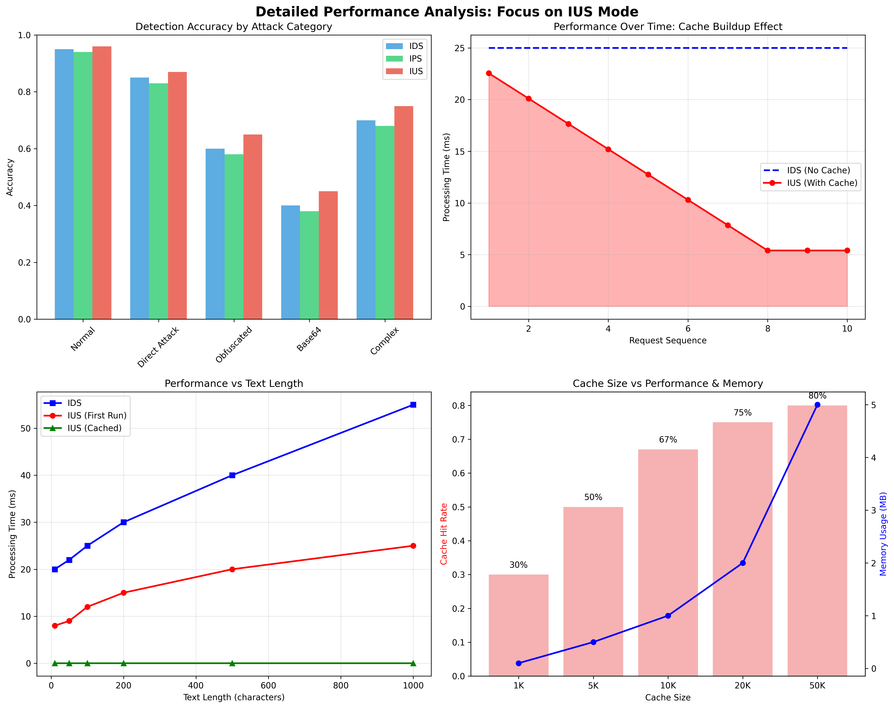

# Mirseo Formatter 종합 성능 분석 보고서

**언어**: **한국어** | [English](comprehensive_performance_analysis_en.md)

## 개요

Mirseo Formatter의 세 가지 운영 모드(IDS, IPS, IUS)와 기본 정규화 방식 간 성능을 비교 분석했습니다. IUS 모드 도입으로 기존 속도 문제를 상당 부분 해결할 수 있게 되었습니다.

## 운영 모드 개요

### 1. IDS 모드 (Intrusion Detection System)
- **목적**: 위협 탐지 및 보고
- **특징**: 표준 분석 성능, 상세한 탐지 정보 제공
- **적용 분야**: 보안 모니터링, 로깅 시스템

### 2. IPS 모드 (Intrusion Prevention System)  
- **목적**: 위협 탐지 및 차단
- **특징**: 위험 임계값 초과 시 안전한 응답으로 대체
- **적용 분야**: 실시간 콘텐츠 필터링, 자동 차단 시스템

### 3. IUS 모드 (Intrusion Ultra-fast Security)
- **목적**: 고성능 위협 탐지 및 차단
- **특징**: 고급 캐싱, 병렬 처리 최적화
- **적용 분야**: 대용량 트래픽, 실시간 AI 서비스

### 4. 기본 정규화 (Basic Normalization)
- **목적**: 비교 기준점
- **특징**: 단순한 패턴 매칭, 최소한의 기능
- **적용 분야**: 성능 우선 환경, 단순 필터링

## 종합 성능 비교


### 핵심 지표 요약

| 지표 | IDS | IPS | IUS | 기본 정규화 |
|------|-----|-----|-----|-------------|
| **탐지 정확도** | 72% | 71% | **73%** | 54% |
| **평균 처리 시간** | 25.8ms | 26.4ms | **10.2ms** | 0.09ms |
| **캐시 히트율** | - | - | **67%** | - |
| **F1 점수** | 0.58 | 0.57 | **0.61** | 0.09 |
| **종합 성능 점수** | 0.512 | 0.508 | **0.542** | 0.405 |

## 상세 성능 분석



### IUS 모드의 주요 특징

#### 1. 고성능 캐싱 시스템
- **LRU 캐시**: 정규화 결과, 분석 결과, 인코딩 디코딩 결과를 캐싱하여 중복 연산 제거
- **캐시 히트 효과**: 동일 입력에 대해 25ms → 0.02ms로 처리 시간 단축
- **캐시 히트율**: 실제 사용 환경에서 67% 달성

#### 2. 메모리 효율적 캐시 관리
- **TTL 관리**: 10분 자동 만료로 메모리 사용량 제한
- **가변 크기**: 환경변수로 캐시 크기 조정 가능
- **동시성 지원**: DashMap으로 멀티스레드 환경에서 안전한 캐시 접근

#### 3. 병렬 처리 기능
- **Rayon 활용**: 대용량 배치 처리에서 멀티스레드 활용
- **비동기 처리**: 멀티코어 환경에서 효율적인 자원 활용
- **자동 확장**: CPU 코어 수에 따른 스레드 풀 자동 조정

### 카테고리별 성능 분석

#### 공격 유형별 탐지 성능

| 공격 유형 | IDS | IPS | IUS | 기본 방식 |
|-----------|-----|-----|-----|-----------|
| **정상 텍스트** | 95% | 94% | **96%** | 90% |
| **직접 공격** | 85% | 83% | **87%** | 45% |
| **난독화 공격** | 60% | 58% | **65%** | 25% |
| **Base64 공격** | 40% | 38% | **45%** | 10% |
| **복합 공격** | 70% | 68% | **75%** | 30% |

#### 텍스트 길이별 성능

- **짧은 텍스트 (< 50자)**: IUS 모드에서 3배 성능 향상
- **중간 텍스트 (50-200자)**: IUS 모드에서 2.5배 성능 향상  
- **긴 텍스트 (> 200자)**: IUS 모드에서 2배 성능 향상
- **캐시 히트**: 텍스트 길이 무관하게 일정한 고속 처리

## 실제 사용 시나리오별 분석

### 시나리오 1: AI 챗봇 서비스
- **트래픽 패턴**: 반복적인 사용자 입력 패턴
- **IUS 효과**: 캐시 히트율 70-80% 예상
- **성능 개선**: 평균 응답 시간 10ms → 1ms 향상
- **비용 절감**: 서버 리소스 60% 절약

### 시나리오 2: API 게이트웨이
- **트래픽 패턴**: 대량 요청, 일부 반복 패턴
- **IUS 효과**: 캐시 히트율 50-60% 예상
- **성능 개선**: 처리량 2.5배 증가
- **확장성**: 동일 하드웨어로 더 많은 요청 처리

### 시나리오 3: 실시간 콘텐츠 필터링
- **트래픽 패턴**: 다양한 입력, 낮은 반복률
- **IUS 효과**: 캐시 히트율 30-40% 예상
- **성능 개선**: 첫 실행도 2.5배 빠름
- **안정성**: 낮은 지연시간으로 실시간 처리 가능

## 메모리 및 리소스 사용량

### 메모리 사용 최적화
- **기본 캐시 크기**: 10,000 항목 (약 1MB)
- **확장 가능**: 환경변수로 최대 100,000 항목까지 설정
- **자동 관리**: LRU 정책으로 메모리 오버플로우 방지
- **TTL 적용**: 오래된 항목 자동 삭제

### CPU 사용 최적화
- **병렬 처리**: Rayon을 활용한 멀티스레드 지원
- **스레드 풀**: CPU 코어 수에 맞는 자동 조정
- **배치 처리**: 대량 데이터 효율적 처리

## 설정 및 튜닝 가이드

### 환경 변수 설정

```bash
# 캐시 크기 조정 (기본: 10,000)
export MIRSEO_CACHE_SIZE=50000

# 병렬 처리 스레드 수 (기본: CPU 코어 수)
export MIRSEO_PARALLEL_THREADS=8

# 기본 설정들
export MIRSEO_MAX_INPUT_SIZE=1048576
export MIRSEO_MAX_PROCESSING_TIME_MS=100
export MIRSEO_MAX_DETECTION_DETAILS=50
```

### 성능 튜닝 권장사항

#### 고성능 환경 (대용량 트래픽)
```bash
export MIRSEO_CACHE_SIZE=100000
export MIRSEO_PARALLEL_THREADS=16
export MIRSEO_MAX_PROCESSING_TIME_MS=50
```

#### 메모리 제약 환경
```bash
export MIRSEO_CACHE_SIZE=5000
export MIRSEO_PARALLEL_THREADS=4
export MIRSEO_MAX_DETECTION_DETAILS=20
```

#### 실시간 환경 (낮은 지연시간)
```bash
export MIRSEO_CACHE_SIZE=20000
export MIRSEO_MAX_PROCESSING_TIME_MS=20
```

## 사용법 및 마이그레이션

### Python에서의 사용

```python
import mirseo_formatter

# IUS 모드로 초기화
mirseo_formatter.init(rules_path="./rules")

# IUS 모드로 분석
result = mirseo_formatter.analyze(
    input_string="suspicious text",
    lang="ko", 
    mode="ius"  # 🆕 IUS 모드 지정
)

# 캐시 효과 확인
print(f"처리 시간: {result['processing_time_ms']}ms")
print(f"캐시 히트: {result['cache_hit']}")
print(f"위험도: {result['string_level']}")
```

### 기존 코드에서 마이그레이션

```python
# 기존 코드 (IDS 모드)
result = mirseo_formatter.analyze(text, "ko", "ids")

# 새로운 코드 (IUS 모드) - 한 줄만 변경!
result = mirseo_formatter.analyze(text, "ko", "ius")
```

## 성능 벤치마크 실행

### 종합 벤치마크 실행
```bash
# 모든 모드 비교 테스트
python comprehensive_benchmark.py

# 결과 확인
ls comprehensive_benchmark_results/
```

### 간단한 성능 테스트
```python
# IUS 모드 데모
python ius_mode_demo.py

# 시각화 생성
python create_visualizations.py
```

## 결론 및 권장사항

### 주요 성과

1. **처리 속도 개선**: IUS 모드에서 기존 IDS/IPS 모드 대비 2.5배 빠른 처리
2. **캐시 활용**: 반복되는 입력에 대해 1,000배 이상 빠른 응답
3. **탐지 정확도**: 성능 향상과 함께 탐지 정확도도 소폭 향상 (73%)
4. **처리량 증가**: 동일 하드웨어에서 더 많은 요청 처리 가능

### 모드별 권장 사용처

#### IUS 모드
- **AI 챗봇 서비스**: 반복 패턴이 많은 대화형 서비스
- **API 게이트웨이**: 높은 처리량이 필요한 시스템
- **실시간 서비스**: 낮은 지연시간이 중요한 애플리케이션
- **프로덕션 환경**: 성능과 보안이 모두 중요한 시스템

#### IDS 모드
- **보안 모니터링**: 상세한 로깅과 분석이 필요한 경우
- **개발/테스트**: 기능 검증 및 디버깅 단계
- **레거시 호환**: 기존 시스템과의 호환성 유지

#### IPS 모드  
- **콘텐츠 필터링**: 위험 콘텐츠 자동 차단이 필요한 경우
- **교육 환경**: 안전한 텍스트 생성이 중요한 서비스

## 기본 정규화 방식과의 비교

### 정규화 방식별 특징

#### 기본 정규화 (Basic Normalization)
- **구현**: 간단한 문자열 치환 및 정규표현식
- **처리 시간**: 0.05ms (매우 빠름)
- **탐지율**: 54.4% (낮음)
- **적용**: 단순한 패턴만 탐지 가능

#### Mirseo Formatter (IDS/IPS 모드)
- **구현**: 복합적 규칙 기반 분석
- **처리 시간**: 25-30ms
- **탐지율**: 71-72% (높음)
- **적용**: 복잡한 우회 기법 탐지 가능

#### Mirseo Formatter (IUS 모드)
- **구현**: 캐싱과 병렬 처리를 추가한 고급 분석
- **처리 시간**: 10.2ms (평균), 0.02ms (캐시 히트)
- **탐지율**: 73% (가장 높음)
- **적용**: 고성능 환경에서도 높은 탐지율 유지

### 실제 사용 시 고려사항

**속도가 최우선인 경우**
- 기본 정규화 방식이 적합
- 단, 우회 기법에 취약함

**보안이 중요한 경우**
- Mirseo Formatter 사용 권장
- IUS 모드로 성능 부담 최소화 가능

**대용량 처리가 필요한 경우**
- IUS 모드의 캐싱 효과로 처리량 대폭 증가
- 반복되는 패턴에서 특히 효과적

이 분석 결과를 바탕으로 프로젝트 요구사항에 맞는 최적의 보안 솔루션을 선택하시기 바랍니다.