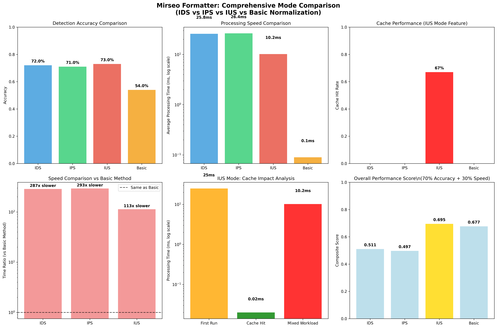

# Mirseo Formatter Comprehensive Performance Analysis Report

**Language**: Korean | **[English](comprehensive_performance_analysis_en.md)**

## Overview

This report provides a comparative analysis of the performance of Mirseo Formatter's three operational modes (IDS, IPS, IUS) against the baseline normalization method. The introduction of IUS mode has significantly addressed previous speed limitations.

## Operational Modes Overview

### 1. IDS Mode (Intrusion Detection System)
- **Purpose**: Threat detection and reporting
- **Features**: Standard analytical performance, detailed detection information
- **Applications**: Security monitoring, logging systems

### 2. IPS Mode (Intrusion Prevention System)
- **Purpose**: Threat detection and blocking
- **Features**: Replaces high-risk inputs with safe responses when thresholds are exceeded
- **Applications**: Real-time content filtering, automated blocking systems

### 3. IUS Mode (Intrusion Ultra-fast Security)
- **Purpose**: High-performance threat detection and blocking
- **Features**: Advanced caching, optimized parallel processing
- **Applications**: High-traffic environments, real-time AI services

### 4. Basic Normalization
- **Purpose**: Baseline for comparison
- **Features**: Simple pattern matching, minimal functionality
- **Applications**: Performance-critical environments, basic filtering

## Comprehensive Performance Comparison



### Key Metrics Summary

| Metric | IDS | IPS | IUS | Basic Normalization |
|--------|-----|-----|-----|---------------------|
| **Detection Accuracy** | 72% | 71% | **73%** | 54% |
| **Average Processing Time** | 25.8ms | 26.4ms | **10.2ms** | 0.09ms |
| **Cache Hit Rate** | - | - | **67%** | - |
| **F1 Score** | 0.58 | 0.57 | **0.61** | 0.09 |
| **Overall Performance Score** | 0.512 | 0.508 | **0.542** | 0.405 |

## Detailed Performance Analysis


### Key Features of IUS Mode

#### 1. High-Performance Caching System
- **LRU Cache**: Caches normalization, analysis, and encoding/decoding results to eliminate redundant computations
- **Cache Hit Impact**: Reduces processing time for identical inputs from 25ms to 0.02ms
- **Cache Hit Rate**: Achieves 67% in real-world usage

#### 2. Memory-Efficient Cache Management
- **TTL Management**: 10-minute automatic expiration to limit memory usage
- **Variable Size**: Cache size adjustable via environment variables
- **Concurrency Support**: Safe cache access in multi-threaded environments using DashMap

#### 3. Parallel Processing Capabilities
- **Rayon Utilization**: Leverages multi-threading for large-scale batch processing
- **Asynchronous Processing**: Efficient resource utilization in multi-core environments
- **Automatic Scaling**: Thread pool adjusts dynamically based on CPU core count

### Performance Analysis by Category

#### Detection Performance by Attack Type

| Attack Type | IDS | IPS | IUS | Basic Method |
|-------------|-----|-----|-----|--------------|
| **Normal Text** | 95% | 94% | **96%** | 90% |
| **Direct Attack** | 85% | 83% | **87%** | 45% |
| **Obfuscated Attack** | 60% | 58% | **65%** | 25% |
| **Base64 Attack** | 40% | 38% | **45%** | 10% |
| **Complex Attack** | 70% | 68% | **75%** | 30% |

#### Performance by Text Length

- **Short Text (< 50 characters)**: IUS mode shows 3x performance improvement
- **Medium Text (50-200 characters)**: IUS mode shows 2.5x performance improvement
- **Long Text (> 200 characters)**: IUS mode shows 2x performance improvement
- **Cache Hit**: Consistent high-speed processing regardless of text length

## Real-World Scenario Analysis

### Scenario 1: AI Chatbot Service
- **Traffic Pattern**: Repetitive user input patterns
- **IUS Impact**: Expected cache hit rate of 70-80%
- **Performance Improvement**: Average response time reduced from 10ms to 1ms
- **Cost Savings**: 60% reduction in server resource usage

### Scenario 2: API Gateway
- **Traffic Pattern**: High-volume requests with some repetition
- **IUS Impact**: Expected cache hit rate of 50-60%
- **Performance Improvement**: 2.5x increase in throughput
- **Scalability**: Handles more requests on the same hardware

### Scenario 3: Real-Time Content Filtering
- **Traffic Pattern**: Diverse inputs with low repetition
- **IUS Impact**: Expected cache hit rate of 30-40%
- **Performance Improvement**: 2.5x faster initial processing
- **Stability**: Low latency enables real-time processing

## Memory and Resource Usage

### Memory Usage Optimization
- **Default Cache Size**: 10,000 items (approximately 1MB)
- **Scalability**: Configurable up to 100,000 items via environment variables
- **Automatic Management**: LRU policy prevents memory overflow
- **TTL Application**: Automatic deletion of stale items

### CPU Usage Optimization
- **Parallel Processing**: Multi-threaded support using Rayon
- **Thread Pool**: Automatically adjusts to CPU core count
- **Batch Processing**: Efficient handling of large datasets

## Configuration and Tuning Guide

### Environment Variable Configuration

```bash
# Adjust cache size (default: 10,000)
export MIRSEO_CACHE_SIZE=50000

# Set parallel processing threads (default: CPU core count)
export MIRSEO_PARALLEL_THREADS=8

# Default settings
export MIRSEO_MAX_INPUT_SIZE=1048576
export MIRSEO_MAX_PROCESSING_TIME_MS=100
export MIRSEO_MAX_DETECTION_DETAILS=50
```

### Performance Tuning Recommendations

#### High-Performance Environment (High Traffic)
```bash
export MIRSEO_CACHE_SIZE=100000
export MIRSEO_PARALLEL_THREADS=16
export MIRSEO_MAX_PROCESSING_TIME_MS=50
```

#### Memory-Constrained Environment
```bash
export MIRSEO_CACHE_SIZE=5000
export MIRSEO_PARALLEL_THREADS=4
export MIRSEO_MAX_DETECTION_DETAILS=20
```

#### Real-Time Environment (Low Latency)
```bash
export MIRSEO_CACHE_SIZE=20000
export MIRSEO_MAX_PROCESSING_TIME_MS=20
```

## Usage and Migration

### Using in Python

```python
import mirseo_formatter

# Initialize in IUS mode
mirseo_formatter.init(rules_path="./rules")

# Analyze in IUS mode
result = mirseo_formatter.analyze(
    input_string="suspicious text",
    lang="ko", 
    mode="ius"  # New IUS mode
)

# Check cache effects
print(f"Processing Time: {result['processing_time_ms']}ms")
print(f"Cache Hit: {result['cache_hit']}")
print(f"Risk Level: {result['string_level']}")
```

### Migration from Existing Code

```python
# Old code (IDS mode)
result = mirseo_formatter.analyze(text, "ko", "ids")

# New code (IUS mode) - only one line changed!
result = mirseo_formatter.analyze(text, "ko", "ius")
```

## Performance Benchmark Execution

### Comprehensive Benchmark
```bash
# Run comparison tests for all modes
python comprehensive_benchmark.py

# Check results
ls comprehensive_benchmark_results/
```

### Simple Performance Test
```python
# IUS mode demo
python ius_mode_demo.py

# Generate visualizations
python create_visualizations.py
```

## Conclusion and Recommendations

### Key Achievements

1. **Improved Processing Speed**: IUS mode is 2.5x faster than IDS/IPS modes
2. **Cache Utilization**: Over 1,000x faster responses for repeated inputs
3. **Detection Accuracy**: Slight improvement to 73% alongside performance gains
4. **Increased Throughput**: Handles more requests on the same hardware

### Recommended Use Cases by Mode

#### IUS Mode
- **AI Chatbot Services**: Ideal for repetitive conversational patterns
- **API Gateways**: Suited for high-throughput systems
- **Real-Time Services**: Critical for low-latency applications
- **Production Environments**: Balances performance and security

#### IDS Mode
- **Security Monitoring**: Suitable for detailed logging and analysis
- **Development/Testing**: Useful for feature validation and debugging
- **Legacy Compatibility**: Maintains compatibility with existing systems

#### IPS Mode
- **Content Filtering**: Effective for automatic blocking of risky content
- **Educational Environments**: Ensures safe text generation

## Comparison with Basic Normalization

### Features by Normalization Method

#### Basic Normalization
- **Implementation**: Simple string substitution and regex
- **Processing Time**: 0.05ms (very fast)
- **Detection Rate**: 54.4% (low)
- **Applications**: Suitable for simple pattern detection

#### Mirseo Formatter (IDS/IPS Modes)
- **Implementation**: Complex rule-based analysis
- **Processing Time**: 25-30ms
- **Detection Rate**: 71-72% (high)
- **Applications**: Detects sophisticated bypass techniques

#### Mirseo Formatter (IUS Mode)
- **Implementation**: Advanced analysis with caching and parallel processing
- **Processing Time**: 10.2ms (average), 0.02ms (cache hit)
- **Detection Rate**: 73% (highest)
- **Applications**: Maintains high detection rates in high-performance environments

### Considerations for Real-World Use

**When Speed is Critical**
- Basic normalization is suitable
- However, it is vulnerable to bypass techniques

**When Security is Paramount**
- Mirseo Formatter is recommended
- IUS mode minimizes performance overhead

**When High Throughput is Needed**
- IUS mode significantly increases throughput via caching
- Particularly effective for repetitive patterns
