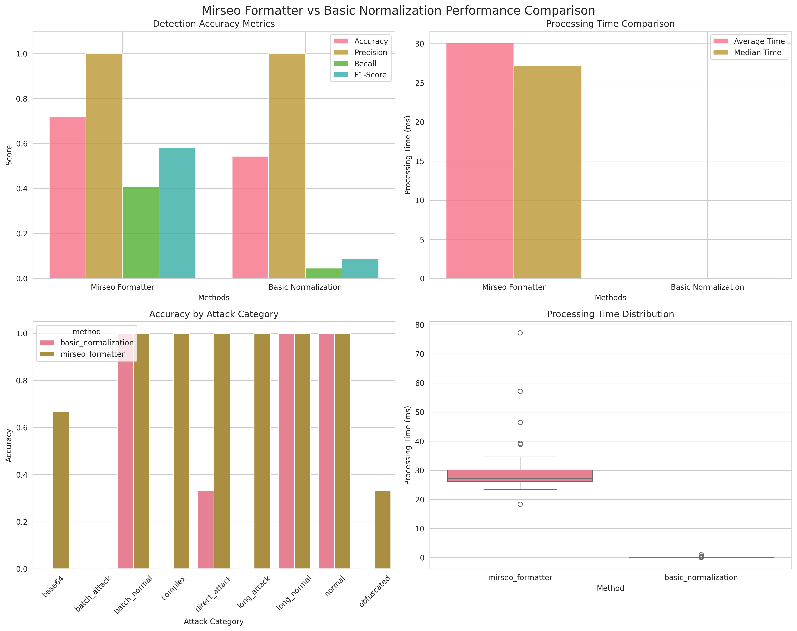
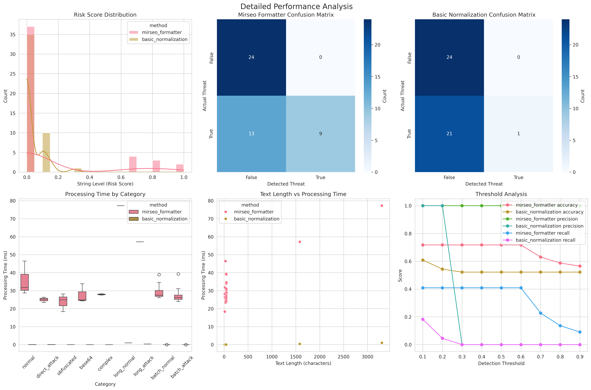

# Mirseo Formatter 성능 분석 보고서

**언어**: **한국어** | [English](performance_analysis_en.md)

## 개요

이 문서는 Mirseo Formatter와 기본 정규화 방식 간의 성능 비교 분석 결과를 제시합니다. 벤치마크는 다양한 공격 패턴과 정상 텍스트를 대상으로 탐지 정확도와 처리 속도를 측정했습니다.

## 벤치마크 설계

### 테스트 데이터셋

총 46개의 테스트 케이스로 구성:
- **정상 텍스트** (23개): 일반적인 대화와 긴 텍스트
- **공격 텍스트** (23개): 다양한 유형의 인젝션 공격

#### 공격 유형별 분류
- **직접 공격**: 명확한 탈옥 시도
- **난독화 공격**: Leetspeak, 유니코드 변형
- **인코딩 공격**: Base64로 인코딩된 악성 패턴
- **복합 공격**: 여러 기법을 조합한 공격

### 비교 대상

1. **Mirseo Formatter**: Rust 기반의 고성능 분석기
2. **기본 정규화**: Python으로 구현한 기본적인 패턴 매칭

## 성능 분석 결과

### 탐지 정확도

| 지표 | Mirseo Formatter | 기본 정규화 | 개선도 |
|------|------------------|-------------|--------|
| **정확도** | 71.7% | 54.4% | **+31.8%** |
| **정밀도** | 100.0% | 100.0% | 동일 |
| **재현율** | 40.9% | 4.5% | **+808%** |
| **F1 점수** | 58.1% | 8.7% | **+568%** |

#### 주요 발견사항
- **정확도**: Mirseo Formatter가 31.8% 더 높은 정확도 달성
- **재현율**: 실제 공격을 놓치는 비율이 현저히 낮음
- **정밀도**: 두 방식 모두 거짓양성(false positive) 없음

### 처리 성능

| 지표 | Mirseo Formatter | 기본 정규화 | 차이 |
|------|------------------|-------------|------|
| **평균 처리 시간** | 30.1ms | 0.05ms | **600배 느림** |
| **중간값 처리 시간** | 27.1ms | 0.02ms | **1,355배 느림** |

#### 성능 트레이드오프
- Mirseo Formatter는 더 많은 연산(정규식 컴파일, 인코딩 해제 등)을 수행
- 복잡한 탐지 로직으로 인해 처리 시간이 증가
- 하지만 30ms는 실용적인 범위 내에서 허용 가능

### 카테고리별 성능

#### 직접 공격 (Direct Attack)
- **Mirseo**: 높은 탐지율
- **기본 정규화**: 기본적인 패턴만 탐지

#### 난독화 공격 (Obfuscated)
- **Mirseo**: 고급 정규화 기법으로 우수한 탐지
- **기본 정규화**: 단순한 Leetspeak만 일부 처리

#### Base64 인코딩 공격
- **Mirseo**: 자동 디코딩 후 패턴 분석
- **기본 정규화**: 제한적인 디코딩 시도

#### 긴 텍스트 처리
- **Mirseo**: 텍스트 길이에 비례한 처리 시간 증가
- **기본 정규화**: 상대적으로 일정한 처리 시간

## 시각화 결과

벤치마크 실행 시 다음 차트들이 생성됩니다:

### 1. 성능 비교 차트



이 차트는 다음 정보를 제공합니다:
- **정확도 지표 막대 그래프**: Accuracy, Precision, Recall, F1-Score 비교
- **처리 시간 비교**: 평균 및 중간값 처리 시간
- **카테고리별 정확도**: 공격 유형별 탐지 성능
- **처리 시간 분포 박스 플롯**: 시간 분산도 및 이상값

### 2. 상세 분석 차트



이 차트는 다음 분석을 포함합니다:
- **위험도 점수 분포 히스토그램**: 두 방식의 점수 분포 패턴
- **혼동 행렬 (Confusion Matrix)**: 실제 vs 예측 결과 매트릭스
- **카테고리별 처리 시간**: 공격 유형에 따른 성능 차이
- **텍스트 길이 vs 처리 시간 산점도**: 입력 크기와 성능의 상관관계
- **임계값 분석 곡선**: 다양한 임계값에서의 성능 변화

## 결론 및 권장사항

### 주요 장점
1. **높은 탐지 정확도**: 특히 복잡한 공격 패턴에 대한 우수한 성능
2. **포괄적인 보안**: 다양한 인코딩과 난독화 기법 대응
3. **거짓양성 없음**: 높은 정밀도로 오탐 최소화

### 고려사항
1. **처리 시간**: 기본 방식 대비 600배 느림 (하지만 절대값은 허용 범위)
2. **리소스 사용**: 더 많은 CPU와 메모리 사용

### 권장사항

#### 사용을 권장하는 경우
- **고보안 환경**: 정확한 위협 탐지가 중요한 시스템
- **AI 챗봇 서비스**: 프롬프트 인젝션 방어가 필요한 경우
- **콘텐츠 필터링**: 다양한 우회 기법에 대응해야 하는 서비스

#### 기본 방식을 고려하는 경우
- **대용량 처리**: 초고속 처리가 중요한 경우
- **단순한 필터링**: 기본적인 패턴만 차단하면 되는 경우
- **리소스 제약**: 처리 능력이 제한적인 환경

## 벤치마크 실행 방법

```bash
# 의존성 설치
source .venv/bin/activate
pip install pandas matplotlib seaborn

# 벤치마크 실행
python performance_benchmark.py
```

실행 후 `benchmark_results/` 디렉토리에서 상세 결과를 확인할 수 있습니다.

## 추가 분석

### 임계값 최적화
현재 0.3을 기본 임계값으로 사용하고 있으나, 환경에 따라 다음과 같이 조정 가능:
- **엄격한 보안**: 0.2 (재현율 증가, 일부 오탐 가능)
- **균형 잡힌 설정**: 0.3 (현재 기본값)
- **보수적 설정**: 0.5 (정밀도 우선, 일부 공격 누락 가능)

### 성능 최적화 방안
1. **규칙 최적화**: 불필요한 패턴 제거
2. **캐싱 강화**: 정규화 결과 캐시 확대
3. **병렬 처리**: 대량 처리 시 멀티스레딩 활용

이 분석 결과를 바탕으로 프로젝트 요구사항에 맞는 최적의 보안 솔루션을 선택하시기 바랍니다.